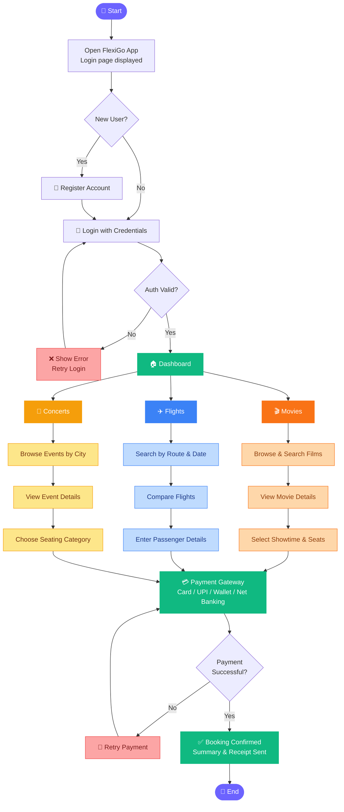

<div align="center">

<!-- Animated banner -->


</div>

---

## 📽️ Demo Video

<div align="center">

**▶️ Watch FlexiGo in action — full end-to-end booking walkthrough**

https://github.com/user-attachments/assets/40ee5024-83c9-48cc-8abc-36e03aa8f765

</div>

---

## 🌟 What is FlexiGo?

> **FlexiGo** is a **centralized ticket booking platform** that unifies movie, flight, and concert reservations into one sleek, secure web application — eliminating the need to juggle multiple apps.

---

## 🚩 Problem Statement


Most ticket booking platforms are **siloed**:
- 🎬 One app for movies
- ✈️ Another for flights
- 🎵 Yet another for concerts

Users waste time switching between apps just to plan a single outing or trip. **FlexiGo fixes this** by bringing all three into one seamless, secure, and fast platform with a unified login and payment system.

---

## ✅ Solution at a Glance

| Challenge | FlexiGo's Answer |
|---|---|
| Multiple apps needed | Single unified platform |
| Separate logins | One secure account for everything |
| Slow booking process | Streamlined 3-step flow |
| Payment scattered | Integrated multi-method gateway |
| No booking history | Centralized management dashboard |

---

## 🛠️ Tech Stack

<div align="center">

| Layer | Technology |
|---|---|
| 🏗️ Markup | HTML5 |
| 🎨 Styling | CSS3 + Bootstrap 5 |
| ⚡ Interactivity | JavaScript (Vanilla) |
| 🔧 Backend | PHP |
| 🗄️ Database | MySQL |

</div>

---

## 🔄 Application Workflow



---

## 🚀 Key Features

<div align="center">

</div>

<br/>

| # | Feature | Description |
|---|---|---|
| 🔐 | **Secure Authentication** | Login, registration & password recovery |
| 🎬 | **Movie Booking** | Browse films, pick showtimes, confirm seats |
| ✈️ | **Flight Booking** | Search routes, compare flights, book seats |
| 🎵 | **Concert Booking** | Discover events, choose categories, buy tickets |
| 💳 | **Payment Gateway** | Card, UPI, Wallet & Net banking support |
| 📋 | **Booking Management** | View & track all reservations in one place |
| 📱 | **Responsive Design** | Mobile-first with Bootstrap 5 |
| 🔑 | **Forgot Password** | Hassle-free account recovery flow |

---

## 📂 Module Breakdown

<details>
<summary>🔐 <strong>Authentication Module</strong></summary>
<br/>
Handles user registration, login, and session management via PHP and MySQL. Passwords are securely hashed. Includes a complete Forgot Password recovery flow.
</details>

<details>
<summary>🎬 <strong>Movie Booking Module</strong></summary>
<br/>
Users search films, view details (cast, timing, ratings), select a showtime, pick seats, and confirm — all driven by real-time PHP-MySQL queries.
</details>

<details>
<summary>✈️ <strong>Flight Booking Module</strong></summary>
<br/>
Search by origin, destination, and travel date. Compare available flights, select preferred options, enter passenger details, and proceed to payment.
</details>

<details>
<summary>🎵 <strong>Concert Booking Module</strong></summary>
<br/>
Browse upcoming concerts by city and date. View event details, choose seating categories, and complete ticket purchase with confirmation.
</details>

<details>
<summary>💳 <strong>Payment Module</strong></summary>
<br/>
A secure multi-method gateway supporting Cards, UPI, Wallets, and Net Banking. Processes transactions and generates instant booking confirmation on success.
</details>

---

## 🔮 Future Enhancements

- 🏨 Hotel & stay booking integration
- 🚌 Bus and cab reservation
- 🔔 Push notifications for booking reminders
- 🌍 Multi-language support
- ⭐ User reviews and ratings
- 📊 Admin analytics dashboard
- 📱 Native mobile app (iOS & Android)

---

## ⚙️ Getting Started

```bash
# 1. Clone the repository
git clone https://github.com/YOUR_USERNAME/flexigo.git
cd flexigo

# 2. Import the database
#    Open phpMyAdmin → Import → select flexigo.sql

# 3. Configure DB connection
#    Edit config/db.php with your MySQL credentials

# 4. Start local server
php -S localhost:8000

# 5. Open in browser
#    http://localhost:8000
```

---

## 📄 License

This project is licensed under the [MIT License](LICENSE).

---

<div align="center">


**⭐ If you found this project useful, give it a star!**

*Made with ❤️ — FlexiGo: Book Everything, Everywhere*

</div>
